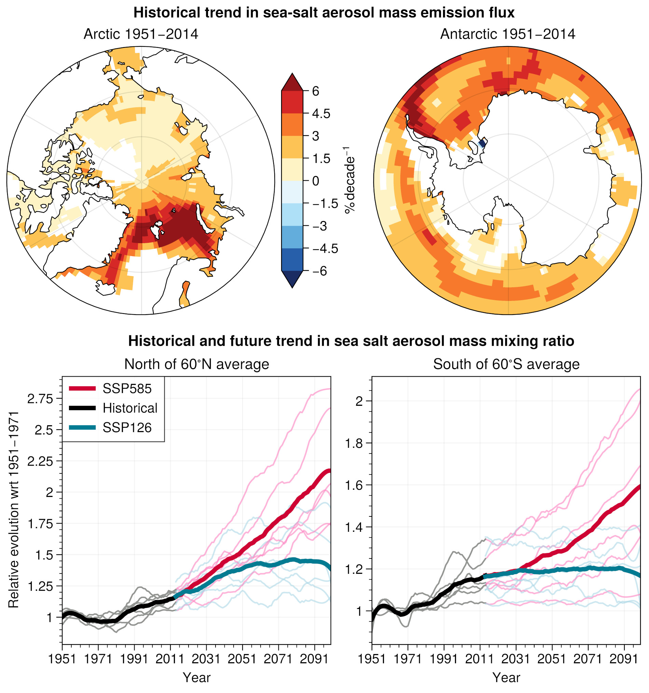

# The representation of sea salt aerosols and their role in polar climate within CMIP6

This repository contains the scripts to reproduce the figures and computations in *Lapere et al., 2023* - The representation of sea salt aerosols and their role in polar climate within CMIP6, PREPRINT 10.1002/essoar.10512918.1

The file *data_obs_seasonal.csv* contains the aggregated ground station measurements used to evaluate the models. Original data references can be found in the article manuscript.

The sea salt aerosol optical depth product derived from MODIS and created for this publication is available on Zenodo at: 

  
<figcaption align = "center"><b>Fig.11 - Top: trends in sea salt aerosol mass emissions in the ensemble mean for the period 1951-2014. Bottom: historical and future (relative to the 1951-1971 mean) yearly time series (1951-2099) of average sea salt surface mass mixing ratio north of 60&deg;N (left) and south of 60&deg;S (right). Time series are smoothed using a Savitzky-Golay filter with a window length of 19 years and a polynomial order 3. Ensemble means are shown as thicker lines (black for the historical period, blue for SSP126, red for SSP585). Individual members use the same color code but with thinner lines. Included models are: GISS, HadGEM, MIROC-ES2L, MRI-ESM, NorESM and UKESM</b></figcaption>

 
> This project has received funding from the European Union's Horizon 2020 research and innovation programme under grant agreement No 101003826 via project CRiceS (Climate Relevant interactions and feedbacks: the key role of sea ice and Snow in the polar and global climate system).
